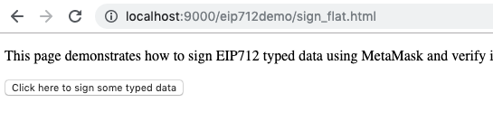
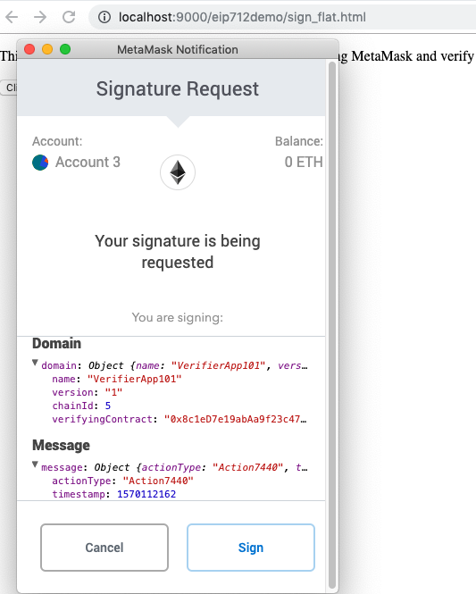
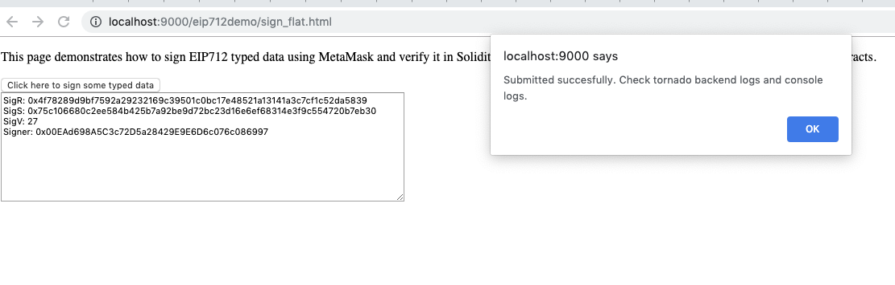
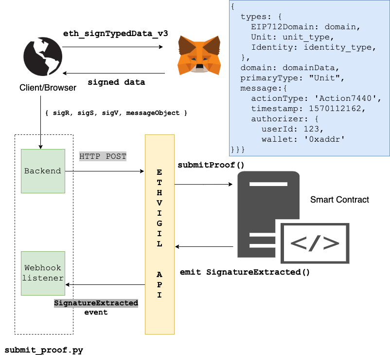
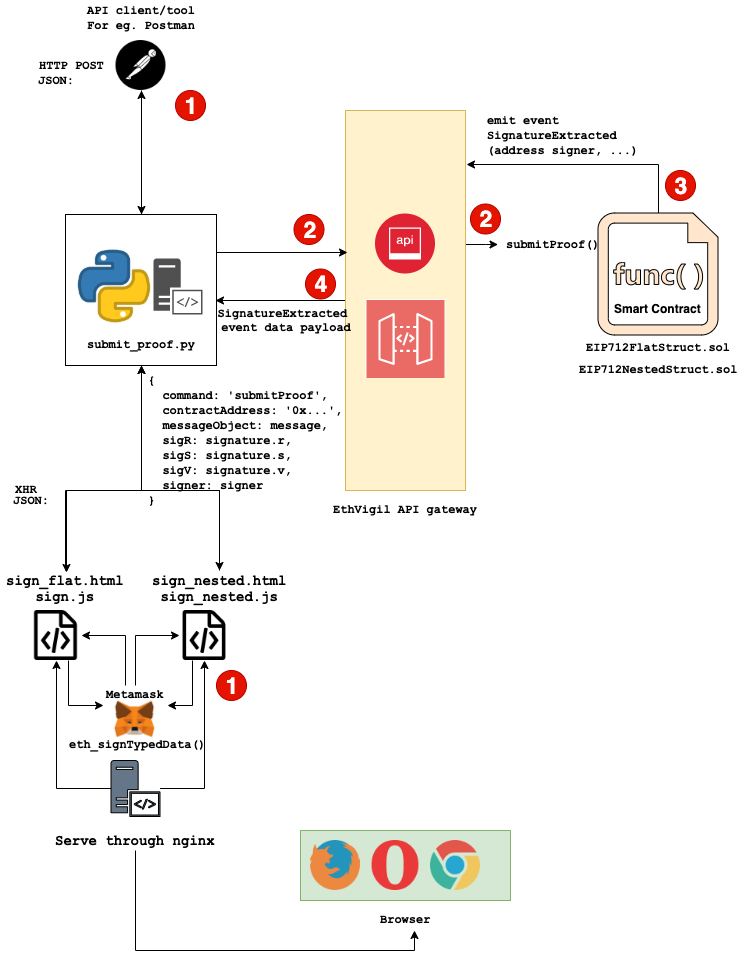

## Prerequisites
It is absolutely critical that you would have gone through at least one of our onboarding guides that will teach you the way EthVigil handles user accounts, signing up, logging in, deploying contracts etc.

If you haven't, go check them out.
* [Getting started with the CLI tool](cli_gettingstarted.md)
* [Getting started with the Web UI](web_gettingstarted.md)

## Evolution of message signing standards on Ethereum

For some context, check out [the legacy way of signing and verifying messages on Ethereum.](eth_sign.md)

The above approach only allows for signing of a bytestring. Which obviously, does not translate well to a good user experience.

EIP stands for Ethereum Improvement Proposal.
[Read the EIP-712 document here](https://github.com/ethereum/EIPs/blob/master/EIPS/eip-712.md)

The document states the motivation behind EIP-712 as 

>to improve the usability of off-chain message signing for use on-chain. We are seeing growing adoption of off-chain message signing as it saves gas and reduces the number of transactions on the blockchain. Currently signed messages are an opaque hex string displayed to the user with little context about the items that make up the message.

### Legacy `eth_sign`
The hex string containing bytes looks something like this in Metamask when an end user wishes to sign (from the legacy `eth_sign` approach):


### Improved `eth_signTypedData` as described in EIP-712
*Instead, EIP-712 presents a clear schema and structure of the message to be signed that looks like this in Metamask*


## How to run this example

The code for this example can be found in our [github repo.](https://github.com/blockvigil/api-usage-examples/tree/master/EIP-712)

### Python

`pip install -r requirements.txt`

`python submit_proof.py`

### Run `ngrok`
Open another terminal window/tab.

Tunnel it to port 6635 on localhost

`./ngrok http 6635`

We will need the link [to set up webhook integration](web_gettingstarted.md#adding-integrations) on the `SignatureExtracted` event emitted fom the contracts.


### Deploy the smart contracts

* [EIP712FlatStruct.sol](https://github.com/blockvigil/api-usage-examples/blob/master/EIP-712/EIP712FlatStruct.sol)
* [EIP712NestedStruct.sol](https://github.com/blockvigil/api-usage-examples/blob/master/EIP-712/EIP712NestedStruct.sol)

Note down the deployed contract addresses. `0x8e12f01dae5fe7f1122dc42f2cb084f2f9e8aa03` and  `0x583e7a6f0de3ecbe8e878878d5ac5c19bc1c807e` respectively, for this example, on the Goerli Ethereum Test network.

* [Deploy with EthVigil web UI](web_gettingstarted.md#deploy-a-solidity-smart-contract)
* [Deploy with EthVigil command line  tool](cli_gettingstarted.md#deploy-a-solidity-smart-contract)

### Setting up the frontend
* `sign_flat.html` & `sign.js`
* `sign_nested.html` & `sign_nested.js`

Arrange these to be served through a server. For this example, we will use the Python 3 module http.server directly from the command line for a quick setup. 

```
python3 -m http.server

Serving HTTP on 0.0.0.0 port 8000 (http://0.0.0.0:8000/) ...
127.0.0.1 - - [24/Oct/2019 19:13:16] "GET /sign_flat.html HTTP/1.1" 200 - 
``` 
On further interaction, `sign.js` launches Metamask to generate a 65 byte signed data that is sent to the python script, [`submit_proof.py`](https://github.com/blockvigil/api-usage-examples/blob/master/EIP-712/submit_proof.py)


Now the frontend can be accessed through the browser at `http://localhost:8000`


### Switch Metamask network to Goerli test net


This is necesssary because Metamask places a strict check on the network ID specified in the data message object sent to `eth_signTypedData`. And all our signed messages are sent to contracts deployed on this specific test network, Goerli. 

### Configure webhook integration with deployed contracts

Find out the ngrok forwarding URL from [the above section](eip712.md#run-ngrok)

Add the ngrok URL as a webhook integration with a trailing `/webhook` path, for eg, `https://8237bb46.ngrok.io/flat`


### Edit javascript files

Fill in the respective deployed contract addresses for the flat and nested struct examples in `sign.js` and `sign_nested.js`. Find the section at the end where the script sends a XHR to the python tornado server running at `http://localhost:6635`

```js
 var data = JSON.stringify({
    command: 'submitProof',
    // replace the following with the deployed EIP712FlatStruct.sol contract address
    contractAddress: '0x8e12f01dae5fe7f1122dc42f2cb084f2f9e8aa03',
    messageObject: message,
    sigR: signature.r,
    sigS: signature.s,
    sigV: signature.v,
    signer: signer

});

xhr.send(data); 
```

### Putting it all together

Visit either `sign_flat.html` or `sign_nested.html`. [According to our section on setting up the frontend](eip712.md#setting-up-the-frontend) they will be available at
* http://localhost:8000/sign_flat.html
* http://localhost:8000/sign_nested.html

#### Sign a flat structured typed message object
Click on the button on the page. It should cause Metamask to pop up a new window. Observe the message object contents and typed schema.



Sign and you should see something like this:


Check the `python submit_proof.py` logs

``` 
{
    'command': 'submitProof', 
    'contractAddress': '0x8e12f01dae5fe7f1122dc42f2cb084f2f9e8aa03', 
    'messageObject': {
        'actionType': 'Action7440', 
        'timestamp': 1570112162, 
        'authorizer': 'auth239430'
    }, 
    'sigR': '0x4f78289d9bf7592a29232169c39501c0bc17e48521a13141a3c7cf1c52da5839', 
    'sigS': '0x75c106680c2ee584b425b7a92be9d72bc23d16e6ef68314e3f9c554720b7eb30', 
    'sigV': 27, 
    'signer': '0x00EAd698A5C3c72D5a28429E9E6D6c076c086997'
}

{"success": true, "data": [{"txHash": "0x55d33ccf8a8eb1fb485c9db4788b9f5f4c28ff4b3bb4a955afce7fc1772a4433"}]}

```
>This is an actual tx on the goerli testnet. You can verify it on [Etherscan explorer](https://goerli.etherscan.io/tx/0x55d33ccf8a8eb1fb485c9db4788b9f5f4c28ff4b3bb4a955afce7fc1772a4433)

Soon the python script will also receive the event data payload corresponding to the `SignatureExtracted` event

```
{
    'txHash': '0x55d33ccf8a8eb1fb485c9db4788b9f5f4c28ff4b3bb4a955afce7fc1772a4433', 
    'logIndex': 0, 
    'blockNumber': 1521811, 
    'transactionIndex': 1, 
    'contract': '0x8e12f01dae5fe7f1122dc42f2cb084f2f9e8aa03', 
    'event_name': 'SignatureExtracted', 
    'event_data': {
        'action': 'Action7440', 
        'signer': '0x00ead698a5c3c72d5a28429e9e6d6c076c086997'
     }, 
     'ethvigil_event_id': 152, 
     'ctime': 1571845963
 } 
```


Observe `['event_data']['signer']` is `0x00ead698a5c3c72d5a28429e9e6d6c076c086997`

That's the address I used to sign the above typed structured data.


#### Sign a nested structured typed message object

Visit the `sign_nested.html` file and follow the similar steps as mentioned above.

Observe how the nested data structure shows up on the signing alert window.


Check the `submit_proof.py` logs as described above.

## Structure of this example
>For a detailed flow diagram, visit the last section in this doc: [Detailed Flow Diagram](eip712.md#detailed-flow-diagram)

### An overview of the entire setup




### The smart contracts

There are two contracts included with this example to demonstrate two different scenarios regarding the complexity of the data structure to be signed.
* A flat structure with elementary types – [EIP712FlatStruct.sol](https://github.com/blockvigil/api-usage-examples/blob/master/EIP-712/EIP712FlatStruct.sol)
* A nested structure – [EIP712NestedStruct.sol](https://github.com/blockvigil/api-usage-examples/blob/master/EIP-712/EIP712NestedStruct.sol)

Both of them have two methods to play with

#### 1. `function submitProof()`

``` 
function submitProof(Unit memory _msg, bytes32 sigR, bytes32 sigS, uint8 sigV) public {
    address recovered_signer = ecrecover(hashUnit(_msg), sigV, sigR, sigS);
    emit SignatureExtracted(recovered_signer, _msg.actionType);

}
```

The ECDSA signature generated by `eth_signTypedData` is 65 bytes long. It is broken down into three components `r`, `s`, `v` which are passed to this method.

The in-built Solidity function `ecrecover()` is run against the hashed value of the contents of the message object (`Unit memory _msg`) 
>Learn more about the structure of the message objects in the section: [Details of the data type to be signed](eip712.md#details-of-the-typed-data-structure-to-be-signed)
 
#### 2. `function testVerify()`

This contains pre-calculated values of `r`, `s`, `v` components of the signature
* signed by the private key of the Ethereum address `0x00EAd698A5C3c72D5a28429E9E6D6c076c086997`
* corresponding to the message object, `_msgobj` (also populated within the method)

This is a call to demonstrate that running `ecrecover()` against the hash of the contents of the `_msgobj` and the `r`, `s`, `v` components yields the expected signer address, `0x00EAd698A5C3c72D5a28429E9E6D6c076c086997`.

```
// this contains a pre-filled struct Unit and the signature values for the same struct calculated by sign.js
function testVerify() public view returns (bool) {

    Unit memory _msgobj = Unit({
       actionType: 'Action7440',
       timestamp: 1570112162,
       authorizer: 'auth239430'
    });

    bytes32 sigR = 0x4f78289d9bf7592a29232169c39501c0bc17e48521a13141a3c7cf1c52da5839;
    bytes32 sigS = 0x75c106680c2ee584b425b7a92be9d72bc23d16e6ef68314e3f9c554720b7eb30;
    uint8 sigV = 27;

    address signer = 0x00EAd698A5C3c72D5a28429E9E6D6c076c086997;

    return signer == ecrecover(hashUnit(_msgobj), sigV, sigR, sigS);
} 
```

### A note about `DOMAIN_SEPARATOR` 
From the solidity code of the smart contracts,

``` 
bytes32 private constant EIP712_DOMAIN_TYPEHASH = keccak256("EIP712Domain(string name,string version,uint256 chainId,address verifyingContract)");

bytes32 private DOMAIN_SEPARATOR = keccak256(abi.encode(
        EIP712_DOMAIN_TYPEHASH,
        keccak256("VerifierApp101"),  // string name
        keccak256("1"),  // string version
        chainId,  // uint256 chainId
        0x8c1eD7e19abAa9f23c476dA86Dc1577F1Ef401f5  // address verifyingContract
    ));
```

Compare it to the standard [laid down in EIP-712 docs](https://github.com/ethereum/EIPs/blob/master/EIPS/eip-712.md#definition-of-domainseparator)

``` 
struct named EIP712Domain with one or more of the below fields. 
Protocol designers only need to include the fields that make sense for their signing domain. 
Unused fields are left out of the struct type.

* `string name` the user readable name of signing domain, i.e. the name of the DApp or the protocol.
* `string version` the current major version of the signing domain. Signatures from different versions are not compatible.
* `uint256 chainId`the EIP-155 chain id. The user-agent should refuse signing if it does not match the currently active chain.
* `address verifyingContract` the address of the contract that will verify the signature. The user-agent may do contract specific phishing prevention.
* `bytes32 salt` an disambiguating salt for the protocol. This can be used as a domain separator of last resort.
```

>This example assumes the following
>* a constant `chainId` = 5, because our code is deployed on the Goerli testnet through the Beta EthVigil APIs (contained in the smart contract code, not dynamically initialized through constructors or transactions)
>* a fixed value for `verifyingContract` . This is again left to the app designer and contract author to agree on to prevent phishing attacks.
>* `bytes32 salt` is omitted without consequence

You can take up implementing the above features as an exercise of your own. Do reach out to us and we would be happy to assist in your development efforts.

### Details of the structured typed data to be signed

* Flat structure with elementary types – [EIP712FlatStruct.sol](https://github.com/blockvigil/api-usage-examples/blob/master/EIP-712/EIP712FlatStruct.sol)

```
struct Unit {
    string actionType;
    uint256 timestamp;
    string authorizer;
} 
```
* Nested structure – [EIP712NestedStruct.sol](https://github.com/blockvigil/api-usage-examples/blob/master/EIP-712/EIP712NestedStruct.sol)
```
struct Unit {
    string actionType;
    uint256 timestamp;
    Identity authorizer;
}

struct Identity {
    uint256 userId;
    address wallet;
}
```


### Preparing message object to be signed
>Take a look at the links in [Further reading](eip712.md#further-reading) section if you are not familiar with the EIP-712 standard. A detailed discussion of concepts like domain, type descriptor strings are out of the scope of this document.
 
`sign.js` and `sign_nested.js` prepare the message object to be passed to `eth_signTypedData` via Metamask.

Let us take a look at the code inside `sign_nested.js`

`data` is the JSON serialized representation of the message format as defined by EIP-712. The `message` key in it holds the actual contents of the message object to be signed. 

```js
// force the user to unlock their MetaMask
if (web3.eth.accounts[0] == null) {
    alert("Please unlock MetaMask first");
// Trigger login request with MetaMask
    web3.currentProvider.enable().catch(alert)
}
  
const data = JSON.stringify({
      types: {
        EIP712Domain: domain,
        Unit: unit_type,
        Identity: identity_type,
      },
      domain: domainData,
      primaryType: "Unit",
      message: message
    });
    
// pick the signing Ethereum address from metamask   
const signer = web3.toChecksumAddress(web3.eth.accounts[0]);

web3.currentProvider.sendAsync(
  {
   // Metamask sends a notification to sign the message, specifying the
   // configured message object and type schema
    method: "eth_signTypedData_v3",  
    params: [signer, data],
    from: signer
  },
  function(err, result) {
    if (err || result.error) {
      return console.error(result);
    }
    
    //.. send XHR to submit_proof.py 
  });
 ```

The `message` object holds the nested `authorizer` object with elementary typed fields: `uint256 userId`, `address wallet`
```js 
var message = {
        actionType: 'Action7440',
        timestamp: 1570112162,
        authorizer: {
            userId: 123,
            wallet: '0x00EAd698A5C3c72D5a28429E9E6D6c076c086997'
        }
    };
```

### The python code. `submit_proof.py`
It runs a tornado(HTTP) server that listens on port 6635 on three endpoints

* `/flat` - `sign.js` sends the 'flat' message object and the signature generated by `eth_signTypedData` on the same message object to this endpoint
* `/nested` - `sign_nested.js` sends the 'nested' message object and the signature generated by `eth_signTypedData` on the same message object to this endpoint
* `/webhook` - Registered as a webhook integration endpoint on the deployed contract via EthVigil APIs

## Detailed flow diagram


## Further reading
* [EIP712 is coming: What to expect and how to use it](https://medium.com/metamask/eip712-is-coming-what-to-expect-and-how-to-use-it-bb92fd1a7a26)
* [Technical specification of the EIP-712 proposal on Ethereum github](https://github.com/ethereum/EIPs/blob/master/EIPS/eip-712.md)
* [Issuing and Verifying EIP-712 Challenges with Go](https://medium.com/alpineintel/issuing-and-verifying-eip-712-challenges-with-go-32635ca78aaf)